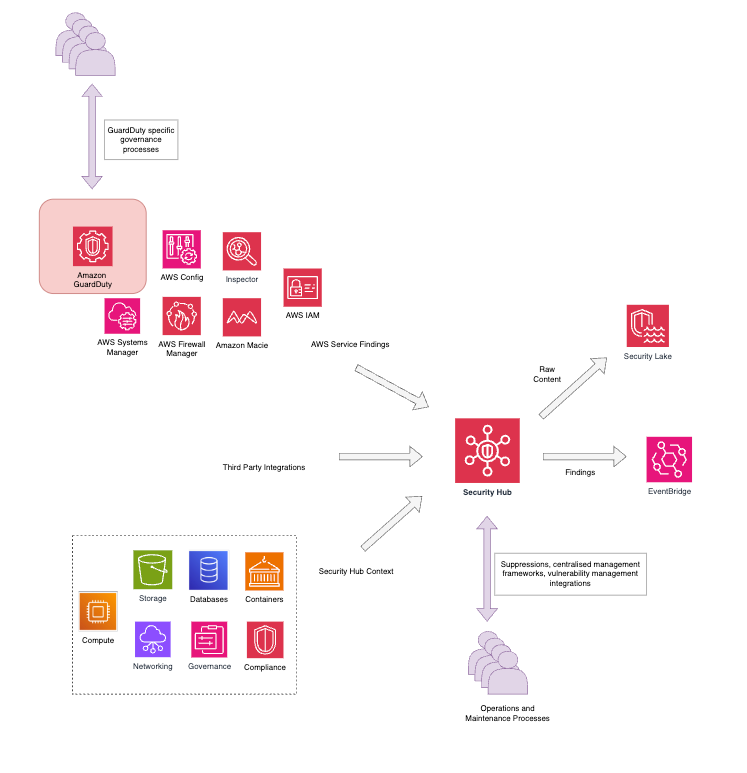

# GuardDuty Suppressions Module
## Please Note:
The recommended rules suppressing findings based on severity do not work https://registry.terraform.io/providers/hashicorp/aws/latest/docs/resources/guardduty_filter. 

This is because the terraform provider has issues and a bug covering the “match” items. In the example linked below, the equals types maps to a list, whereas the gt, gte, lt, lte are all looking at a typestring when it should be a type list wrapped around integers. 
https://github.com/hashicorp/terraform-provider-aws/blob/a8e1b81bfe9d2d559cef7c601266e2be51d34bc2/internal/service/guardduty/filter.go#L77

The terraform provider unit tests don't cover this condition. The greater_than_or_equal ends up creating a duplicate with the old deprecated gt type comparison function and turns the severity into a "null" value which breaks the rule in the console.
The severity criterion should be used using the following: https://docs.aws.amazon.com/AWSCloudFormation/latest/TemplateReference/aws-properties-guardduty-filter-findingcriteria.html

## Global GuardDuty Suppressions
```hcl

Example for suppression rule filtered on severity of LOW (1, 2, 3)

resource "aws_guardduty_filter" "example_filter" {
  name        = "${local.name_prefix}-example-filter"
  action      = "ARCHIVE"
  detector_id = data.aws_guardduty_detector.guardduty_detector.id
  rank        = 1
  finding_criteria {
    criterion {
      field  = "region"
      equals = ["some-region"]
    }
    criterion {
      field      = "service.additionalInfo.threatListName"
      not_equals = ["some-threat", "another-threat"]
    }
    criterion {
      field  = "severity"
      equals = ["1", "2", "3"]
    }
  }
}
# CRSS-XXXX. Example for suppression rule filtered on severity of Medium (4, 5, 6):
# Approved: Person A
resource "aws_guardduty_filter" "example_filter" {
  name        = "${local.name_prefix}-example-filter"
  action      = "ARCHIVE"
  detector_id = data.aws_guardduty_detector.guardduty_detector.id
  rank        = 1

  finding_criteria {
    criterion {
      field  = "region"
      equals = ["some-region"]
    }

    criterion {
      field      = "service.additionalInfo.threatListName"
      not_equals = ["some-threat", "another-threat"]
    }

    criterion {
      field  = "severity"
      equals = ["4", "5", "6"]
    }
  }
}

Example for suppression rule filtered on severity of HIGH (7, 8):

resource "aws_guardduty_filter" "example_filter" {
  name        = "${local.name_prefix}-example-filter"
  action      = "ARCHIVE"
  detector_id = data.aws_guardduty_detector.guardduty_detector.id
  rank        = 1

  finding_criteria {
    criterion {
      field  = "region"
      equals = ["some-region"]
    }

    criterion {
      field      = "service.additionalInfo.threatListName"
      not_equals = ["some-threat", "another-threat"]
    }

    criterion {
      field  = "severity"
      equals = ["7", "8"]
    }
  }
}

Example for suppression rule filtered on severity of CRITICAL (9, 10):

resource "aws_guardduty_filter" "example_filter" {
  name        = "${local.name_prefix}-example-filter"
  action      = "ARCHIVE"
  detector_id = data.aws_guardduty_detector.guardduty_detector.id
  rank        = 1

  finding_criteria {
    criterion {
      field  = "region"
      equals = ["some-region"]
    }

    criterion {
      field      = "service.additionalInfo.threatListName"
      not_equals = ["some-threat", "another-threat"]
    }

    criterion {
      field  = "severity"
      equals = ["9", "10"]
    }
  }
}

Example for suppression rule filtered based finding type:(DefenseEvasion:Runtime/SuspiciousCommand)

resource "aws_guardduty_filter" "example_filter" {
  name        = "${local.name_prefix}-example-filter"
  action      = "ARCHIVE"
  detector_id = data.aws_guardduty_detector.guardduty_detector.id
  rank        = 1

  finding_criteria {
    criterion {
      field  = "region"
      equals = ["some-region"]
    }

    criterion {
      field      = "service.additionalInfo.threatListName"
      not_equals = ["some-threat", "another-threat"]
    }

    criterion {
      field  = "type"
      equals = ["DefenseEvasion:Runtime/SuspiciousCommand"]
    }
  }
}


```

## Finding ID Specific Suppressions
```hcl
Example for single / mulltiple Finding IDs suppression rule:

resource "aws_guardduty_filter" "example_filter" {
  name        = "${local.name_prefix}-example-filter"
  action      = "ARCHIVE"
  detector_id = data.aws_guardduty_detector.guardduty_detector.id
  rank        = 1

  finding_criteria {
    criterion {
      field  = "region"
      equals = ["some-region"]
    }

    criterion {
      field      = "service.additionalInfo.threatListName"
      not_equals = ["some-threat", "another-threat"]
    }

    criterion {
      field  = "id"
      equals = ["example-finding-id-1", "example-finding-id-2"]
    }
  }
}
```

## Account Wide Suppressions

```hcl
# Example suppression resource
# This resource will suppress all findings for the account with the AWS account ID 123456789012
resource "aws_guardduty_filter" "example_filter" {
  name        = "${local.name_prefix}-example-filter"
  action      = "ARCHIVE"
  detector_id = data.aws_guardduty_detector.guardduty_detector.id
  rank        = 1

  finding_criteria {
    criterion {
      field  = "severity"
      equals = ["1", "2", "3"]
    }

    criterion {
      field  = "accountId"
      equals = ["123456789012"]
    }
  }
}

```


